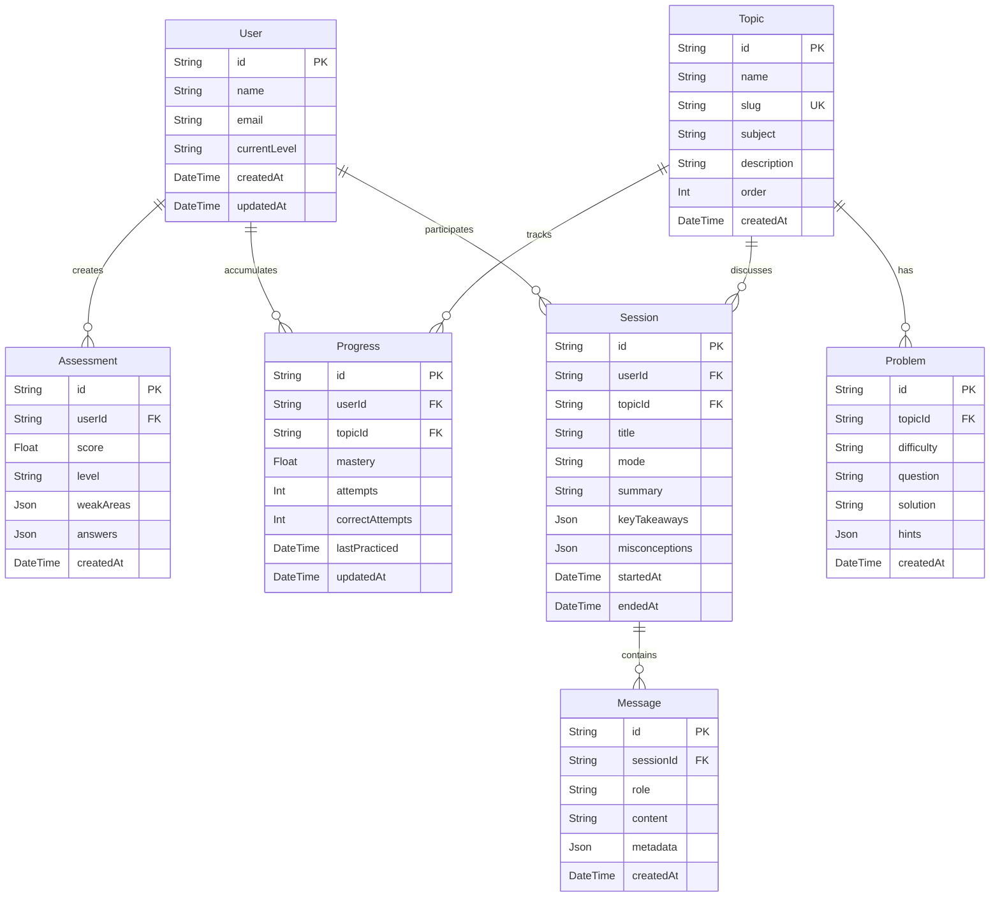

# PROJECT FULL ANALYSIS: AETHER MVP

This document serves as a complete, structured, and highly detailed architectural analysis and codebase map for **Aether**, an AI-powered STEM tutor MVP for high-school Physics. It is designed to act as a master knowledge file that gives developers and LLMs immediate, production-grade understanding of the codebase structure, database schema, data flows, APIs, and product logic.

---

## 1. Project Overview

Aether is an AI-powered tutoring application designed to help high-school students master conceptual Physics—specifically Mechanics and Newton's Laws. Rather than acting as a standard "answer generator," Aether leverages a Socratic tutoring methodology. It evaluates students' qualitative physics reasoning, diagnoses conceptual flaws and misconceptions, tracks mastery metrics dynamically, and offers personalized interactive chat sessions and practice problems.

The system is constructed as a modern full-stack web application leveraging Next.js, SQLite/Turso, Prisma, and Ollama Cloud. It features a complete offline demo mode (`AETHER_DEMO_MODE=true`) which mimics Socratic tutoring flows, making it highly reliable for presentations and development.

---

## 2. Executive Summary

The Aether codebase is clean, modular, and shows a strong separation of concerns.
* **Frontend**: Built with React 19 and Next.js 16 (App Router), styled using Tailwind CSS v4, and featuring subtle, modern UI elements from Radix UI and custom Framer Motion animations.
* **State Management**: Client UI state in the tutoring chat workspace is governed by a lightweight Zustand store.
* **Backend API**: Structured Next.js route handlers handle request routing, payload validation using Zod schemas, and delegation to backend service layers.
* **Database & Persistence**: Managed via Prisma 7 ORM connecting to a Turso (libSQL) database. It implements user progress tracking, learning profile snapshots, chat session history, and practice problem persistence.
* **AI Orchestration**: Delegated to custom service classes using Ollama Cloud API. It features multi-stage fallback (retry logic on schema mismatch) and offline demo fallbacks.
* **Quality Assurance**: A robust Vitest suite validates core logical components such as progress updates, prompt builders, response parsers, and diagnostic scoring algorithms.

---

## 3. Tech Stack Summary

The technical architecture is built on the following stack:

| Layer | Technology | Version | Purpose |
| :--- | :--- | :--- | :--- |
| **Core Framework** | Next.js (App Router) | `16.2.9` | Server-rendered pages, API routes, layout composition, and bundle building. |
| **View Layer** | React | `19.2.4` | Component-driven UI rendering and interactive states. |
| **Language** | TypeScript | `5.x` | Static typing and interface safety. |
| **Styling** | Tailwind CSS | `v4` | Contemporary Utility-first styling with modern variables and themes. |
| **Animations** | Framer Motion | `12.40.0` | Fluent micro-animations and page transitions. |
| **Database ORM** | Prisma | `7.8.0` | Type-safe database client and SQLite/Turso schema mapping. |
| **Database Engine**| Turso / libSQL | Client `0.17.3` | Distributed SQLite relational database hosting for persistent data storage. |
| **State Manager**  | Zustand | `5.0.14` | Global state control in client-side tutor screens. |
| **Validation** | Zod | `4.4.3` | Request payload schema enforcement and API contract verification. |
| **Form Handling**  | React Hook Form | `7.79.0` | Client-side input binding and form state control. |
| **Testing** | Vitest | `4.1.8` | Speed-optimized unit test runner. |
| **Dev Tools** | PostCSS, TSX, ESLint | Latest | Linter support, CSS post-processing, and TypeScript script executor. |

---

## 4. Dependency Analysis

The following dependencies are declared in the project's [package.json](file:///J:/Full-Stack/aether/package.json):

### Runtime Dependencies

* **`next`** (`16.2.9`): Core application framework. Handles routing, compilation, and Server Components.
* **`react`** / **`react-dom`** (`19.2.4`): Foundation library for component rendering. Uses React 19 features.
* **`@prisma/client`** (`7.8.0`): Auto-generated, query-builder client mapped to database schemas.
* **`@prisma/adapter-libsql`** (`7.8.0`): Prisma connector enabling database interactions with Turso/libSQL.
* **`@libsql/client`** (`0.17.3`): Client library connecting backend services to Turso.
* **`zod`** (`4.4.3`): Type-safe schema validation, used for both incoming HTTP payloads and structured AI output parsing.
* **`zustand`** (`5.0.14`): Zero-boilerplate state manager used to control user interaction settings (e.g. current tutoring modes) in [use-tutor-store.ts](file:///J:/Full-Stack/aether/lib/store/use-tutor-store.ts).
* **`react-hook-form`** (`7.79.0`) & **`@hookform/resolvers`** (`5.4.0`): Efficient forms orchestration and connection with Zod schema verification.
* **`framer-motion`** (`12.40.0`): Powers components with hardware-accelerated animations (e.g. sliding chat message bubbles).
* **`lucide-react`** (`1.18.0`): Comprehensive SVG icon toolkit.
* **`class-variance-authority`** (`0.7.1`) / **`clsx`** (`2.1.1`) / **`tailwind-merge`** (`3.6.0`): Key helpers for merging CSS classes and writing variants for UI primitives (like buttons, badges).
* **`@radix-ui/react-slot`** (`1.2.5`): Provides polymorphic behavior (`asChild` prop) to UI primitives.

### Development Dependencies

* **`typescript`** (`5.x`): Adds static typing.
* **`tailwindcss`** (`4.x`) & **`@tailwindcss/postcss`** (`4.x`): Custom styles compilation.
* **`vitest`** (`4.1.8`): Execution runner for the unit test suite.
* **`eslint`** (`9.x`) & **`eslint-config-next`** (`16.2.9`): Code quality linters and styling guidelines check.
* **`prisma`** (`7.8.0`): Command-line tool supporting migrations, introspections, and client regenerations.
* **`tsx`** (`4.22.4`): Zero-config TypeScript executor, used primarily for database seeding and running Turso migrations.

---

## 5. Architecture Overview

Aether is built as a monolithic full-stack application following a model-view-controller (MVC) inspired design structure adapted to Next.js conventions:

```
+-----------------------------------------------------------+
|                        Client UI                          |
|         (React Components, Zustand, Framer Motion)        |
+-----------------------------+-----------------------------+
                              |
                              | Fetch HTTP requests
                              v
+-----------------------------------------------------------+
|                    Next.js API Routes                     |
|           (Zod Input Payload Validator schemas)           |
+-----------------------------+-----------------------------+
                              |
                              | Delegates logic
                              v
+-----------------------------------------------------------+
|                       Service Layer                       |
|   (Assessment, Progress, AI Services & Response Parsers)   |
+---------------------+-------------------------------+-----+
                      |                               |
        Reads/Writes  |                               | Fetch Call
                      v                               v
+---------------------------------------+   +-----------------------+
|          Prisma DB Client             |   |   Ollama Cloud API    |
|   (Adapter-LibSQL / SQLite Database)  |   |   (With Demo Mode)    |
+---------------------------------------+   +-----------------------+
```

### Server-Client Boundaries
* **Server Components**: Used primarily in page configurations (like [TutorSessionPage](file:///J:/Full-Stack/aether/app/tutor/[sessionId]/page.tsx)) to fetch initial records (e.g. retrieving current session details) directly from Prisma, avoiding unnecessary fetch waterfalls.
* **Client Components**: Leveraged in highly interactive layouts (e.g., [ChatInterface](file:///J:/Full-Stack/aether/components/tutor/chat-interface.tsx) or [AssessmentPage](file:///J:/Full-Stack/aether/app/assessment/page.tsx)) that require immediate visual updates, animation cycles, and browser API integrations (`localStorage`).
* **API Handlers**: Standalone endpoints defined under `/api/...` process updates and perform complex tasks, such as generating AI problems, evaluating student response quality, or finalizing learning sessions.

---

## 6. Folder and File Structure Breakdown

The codebase layout is mapped as follows:

* **`app/`**: Application routes, pages, layouts, and API endpoints.
  * **`api/`**: Next.js route handlers acting as API endpoints.
    * **`assessment/`**: [route.ts](file:///J:/Full-Stack/aether/app/api/assessment/route.ts) handles diagnostic assessment submissions, creates guest users, saves profiles, and seeds initial progress.
    * **`problems/`**: [route.ts](file:///J:/Full-Stack/aether/app/api/problems/route.ts) triggers AI generation of physics practice problems and saves them.
    * **`progress/`**: [route.ts](file:///J:/Full-Stack/aether/app/api/progress/route.ts) fetches user details and topic-specific mastery metrics.
    * **`sessions/`**:
      * [route.ts](file:///J:/Full-Stack/aether/app/api/sessions/route.ts) creates new learning sessions or lists existing ones.
      * **`[sessionId]/`**: [route.ts](file:///J:/Full-Stack/aether/app/api/sessions/[sessionId]/route.ts) retrieves details or updates and finalizes sessions.
    * **`tutor/`**: [route.ts](file:///J:/Full-Stack/aether/app/api/tutor/route.ts) processes student input, stores messages, evaluates mastery updates, and generates tutor replies.
  * **`assessment/`**: Onboarding page that displays the diagnostic questions.
  * **`dashboard/`**: Student dashboard visualizing level, recommended topic, weak areas, and session history.
  * **`history/`**: Historical session viewer showing takeaways and detected misconceptions.
  * **`tutor/`**:
    * [page.tsx](file:///J:/Full-Stack/aether/app/tutor/page.tsx): Entry screen to launch a new session.
    * **`[sessionId]/`**: Dynamic tutoring interface with active workspace chat.
  * [globals.css](file:///J:/Full-Stack/aether/app/globals.css): Core global styling setup.
  * [layout.tsx](file:///J:/Full-Stack/aether/app/layout.tsx): Top-level wrapper defining custom fonts and page structure.
  * [page.tsx](file:///J:/Full-Stack/aether/app/page.tsx): Main marketing landing screen.
* **`components/`**: Modular presentation components.
  * **`assessment/`**: UI controls for diagnostic questions, progress, and results.
  * **`dashboard/`**: Panels representing mastery maps, level cards, and weak topics.
  * **`layout/`**: Shell wrappers, navbar layouts, and sidebars.
  * **`problems/`**: Visual cards representing practice questions and multi-step hint stacks.
  * **`shared/`**: Common feedback utilities (error indicators, loading displays, empty states).
  * **`tutor/`**: Custom chat bubbles, mode selectors, feedback panels, summary modals, and inputs.
  * **`ui/`**: Core reusable UI primitive layouts (badges, buttons, cards, inputs).
* **`lib/`**: Business logic, helpers, and backend integration.
  * **`ai/`**: Ollama client and AI logic layers.
    * **`prompts/`**: Houses prompt engineering functions for tutors, summaries, and problem generation.
    * [ollama-client.ts](file:///J:/Full-Stack/aether/lib/ai/ollama-client.ts): Handles connection setup, timeouts, authorization, and fallbacks.
    * [tutor-service.ts](file:///J:/Full-Stack/aether/lib/ai/tutor-service.ts): Orchestrates chat interactions.
    * [problem-service.ts](file:///J:/Full-Stack/aether/lib/ai/problem-service.ts): Generates custom practice questions.
    * [summary-service.ts](file:///J:/Full-Stack/aether/lib/ai/summary-service.ts): Formulates end-of-session digests.
    * [response-parser.ts](file:///J:/Full-Stack/aether/lib/ai/response-parser.ts): Extract and parse JSON payloads from raw LLM text.
    * [schemas.ts](file:///J:/Full-Stack/aether/lib/ai/schemas.ts): Zod schema definitions representing structured model outputs.
    * [demo-responses.ts](file:///J:/Full-Stack/aether/lib/ai/demo-responses.ts): Contains mock Socratic replies and practice questions for fallback offline mode.
  * **`api/`**: Validators ([validators.ts](file:///J:/Full-Stack/aether/lib/api/validators.ts)) and JSON response templates ([response.ts](file:///J:/Full-Stack/aether/lib/api/response.ts)).
  * **`assessment/`**: Diagnostic question declarations and calculations.
  * **`progress/`**: Logic files determining student mastery updates based on reasoning quality.
  * **`store/`**: Frontend Zustand store configuration.
  * [db.ts](file:///J:/Full-Stack/aether/lib/db.ts): Single instance constructor for Prisma Client connection.
  * [topics.ts](file:///J:/Full-Stack/aether/lib/topics.ts): List of physical topics.
  * [utils.ts](file:///J:/Full-Stack/aether/lib/utils.ts): Tailwind CSS helper function.
* **`prisma/`**: Schema declarations, SQL migrations, and seeding scripts.
* **`scripts/`**: [apply-turso-schema.ts](file:///J:/Full-Stack/aether/scripts/apply-turso-schema.ts) manually deploys SQL migrations to Turso using the LibSQL client.
* **`tests/`**: Unit test specifications running under Vitest.

---

## 7. Product Purpose and Problem Solved

Standard AI applications act as search engines or answer bots. When asked for help with a physics problem, they simply output the final equation and numerical solution. While convenient, this approach obscures underlying conceptual gaps and misconceptions, leading to poor learning outcomes in subjects like Mechanics.

**Aether solves this by implementing Socratic Tutoring**:
1. **Focuses on Guided Reasoning**: Rather than providing direct answers, Aether asks targeted, sequential questions to encourage active recall.
2. **Prioritizes Qualitative Models**: Students are prompted to identify forces and draw Free Body Diagrams before calculating numerical values.
3. **Monitors Misconceptions**: Aether actively checks for common physical misunderstandings (e.g., the idea that constant velocity requires a continuous forward force) and introduces counter-examples to address them.
4. **Tracks Topic Mastery**: Progress metrics update dynamically based on student responses, highlighting weak areas that need review.

---

## 8. User Roles and Primary Workflows

### User Roles
* **Guest Student**: The single primary user role. Because the MVP does not include an authentication server, a unique UUID (`aetherUserId`) is stored in the browser's `localStorage` to identify the user and persist progress.

### Primary Workflows

```
               +----------------------------------------+
               |         1. Landing Page Loads          |
               +-------------------+--------------------+
                                   |
                                   | "Start Learning" Clicked
                                   v
               +----------------------------------------+
               |        2. Diagnostic Assessment        |
               |     (7 Questions + Written Reasoning)  |
               +-------------------+--------------------+
                                   |
                                   | Submits Answers (Creates User + Progress)
                                   v
               +----------------------------------------+
               |          3. Student Dashboard          |
               |   (Level, Mastery Map, Recommendation) |
               +-------------------+--------------------+
                                   |
                                   | Starts lesson or practice
                                   v
               +----------------------------------------+
               |         4. Tutoring Session            |
               | (Socratic Chat, Mode Selector, Actions)|
               +-------------------+--------------------+
                                   |
                                   | Click "End Session"
                                   v
               +----------------------------------------+
               |       5. Session History / Review      |
               |   (Review summaries and misconceptions)|
               +----------------------------------------+
```

1. **Diagnostic Onboarding**:
   * The user answers 7 multiple-choice conceptual questions in [diagnostic.ts](file:///J:/Full-Stack/aether/lib/assessment/diagnostic.ts).
   * For each question, the user must provide a short written explanation of their reasoning.
   * On submission, the backend evaluates performance, sets the user's level (Beginner, Intermediate, Advanced), initializes topic mastery scores, and saves the student profile.
2. **Dashboard Review**:
   * Displays the user's diagnosed level and weak topics.
   * Renders the **Physics Mastery Map**, displaying progress (0-100%) for each mechanics topic.
   * Recommends a starting topic (typically the first weak topic, or the first topic in the order).
3. **Socratic Tutor Chat**:
   * Displays the primary conversation window.
   * Offers mode selection:
     * *Guided Reasoning*: Socratic mode that guides students step-by-step.
     * *Concept Explanation*: Focuses on explaining physical ideas.
     * *Practice Problems*: Prompts the tutor to generate and guide the student through practice questions.
   * Includes quick action buttons:
     * **Get Hint**: Asks the tutor for a hint.
     * **Explain More**: Requests an inline explanation of a concept.
     * **Generate Practice**: Generates 2-3 tailored practice questions based on the topic.
     * **End Session**: Finalizes the session, generating a summary with key takeaways and misconceptions.
4. **Review History**:
   * Lists past learning sessions.
   * Displays generated session summaries, key takeaways, and detected misconceptions.

---

## 9. Full Feature Inventory

* **Onboarding Diagnostic**: Form interface mapping multiple-choice options and written answers. Evaluates responses and applies a `reasoningBonus` based on key terms.
* **Mastery Visualization**: Progress bars display topic mastery (0-100%) with custom visual indicators (Amber for <45%, Blue for <75%, Green for >=75%).
* **Adaptable AI Tutoring**: Dynamic prompt construction selects instructions based on student level, topic, and previous mistakes.
* **Tutor Action Sidebar**: Simplifies student interactions via automated hint, explanation, and practice generation commands.
* **Structured Practice Cards**: Displays generated physics problems in the sidebar with collapsible, step-by-step hint stacks.
* **Inline Misconception Warnings**: Alerts students to physical misconceptions detected in their responses (e.g. confusing mass with weight, forgetting normal force).
* **Session Summarization**: Generates session reviews, key takeaways, misconceptions, and next steps, and updates topic mastery scores.
* **No-Cloud Demo Mode**: Provides offline fallback configurations, returning realistic mock responses for testing and demonstrations.

---

## 10. Pages / Routes / Screens Breakdown

### Landing Page: `/`
* **File Path**: [app/page.tsx](file:///J:/Full-Stack/aether/app/page.tsx)
* **Purpose**: Marketing landing page.
* **UI Structure**: Renders a marketing hero section, product values, call-to-actions, and an interactive mock preview card illustrating Aether's Socratic tutoring dialogue.
* **Key Components**: [AppShell](file:///J:/Full-Stack/aether/components/layout/app-shell.tsx), [Button](file:///J:/Full-Stack/aether/components/ui/button.tsx), [Card](file:///J:/Full-Stack/aether/components/ui/card.tsx).

### Onboarding Diagnostic: `/assessment`
* **File Path**: [app/assessment/page.tsx](file:///J:/Full-Stack/aether/app/assessment/page.tsx)
* **Purpose**: Hosts the onboarding questionnaire.
* **UI Structure**: Multi-step layout showing progress bars, multiple-choice questions, and explanation text fields. Replaces the form with an assessment summary screen upon submission.
* **Key Components**: [AssessmentProgress](file:///J:/Full-Stack/aether/components/assessment/assessment-progress.tsx), [AssessmentQuestionCard](file:///J:/Full-Stack/aether/components/assessment/assessment-question-card.tsx), [AssessmentResults](file:///J:/Full-Stack/aether/components/assessment/assessment-results.tsx).
* **Data Dependencies**: Fetches data from `/api/assessment` (POST) to save profile information.

### Student Dashboard: `/dashboard`
* **File Path**: [app/dashboard/page.tsx](file:///J:/Full-Stack/aether/app/dashboard/page.tsx)
* **Purpose**: Student center for progress tracking.
* **UI Structure**: Grid layout displaying:
  * User Level and Recommended Topic cards.
  * **Weak Areas Card**: Lists up to 4 topics with mastery scores under 55%.
  * **Recent Sessions Card**: Lists up to 20 past sessions.
  * **Mastery Map Card**: Displays progress bars for all topics.
* **Key Components**: [LevelCard](file:///J:/Full-Stack/aether/components/dashboard/level-card.tsx), [MasteryMap](file:///J:/Full-Stack/aether/components/dashboard/mastery-map.tsx), [WeakAreasCard](file:///J:/Full-Stack/aether/components/dashboard/weak-areas-card.tsx), [RecentSessions](file:///J:/Full-Stack/aether/components/dashboard/recent-sessions.tsx), [LoadingState](file:///J:/Full-Stack/aether/components/shared/loading-state.tsx), [ErrorState](file:///J:/Full-Stack/aether/components/shared/error-state.tsx).
* **Data Dependencies**: Queries `/api/progress?userId=...` and `/api/sessions?userId=...` on render.

### Session List & History: `/history`
* **File Path**: [app/history/page.tsx](file:///J:/Full-Stack/aether/app/history/page.tsx)
* **Purpose**: Displays past session reviews.
* **UI Structure**: Vertical feed of cards indicating session status (Completed, In progress), title, description, summary, key takeaways, and detected misconceptions.
* **Key Components**: [Badge](file:///J:/Full-Stack/aether/components/ui/badge.tsx), [Card](file:///J:/Full-Stack/aether/components/ui/card.tsx), [Button](file:///J:/Full-Stack/aether/components/ui/button.tsx), [EmptyState](file:///J:/Full-Stack/aether/components/shared/empty-state.tsx), [ErrorState](file:///J:/Full-Stack/aether/components/shared/error-state.tsx).
* **Data Dependencies**: Queries `/api/sessions?userId=...` on render.

### Tutor Page Setup: `/tutor`
* **File Path**: [app/tutor/page.tsx](file:///J:/Full-Stack/aether/app/tutor/page.tsx)
* **Purpose**: Welcome screen before starting a tutor session.
* **UI Structure**: Prompt card explaining session generation. Includes action buttons to create a new session or take the diagnostic.
* **Data Dependencies**: Sends a POST request to `/api/sessions` to initialize session records.

### Tutoring Session Workspace: `/tutor/[sessionId]`
* **File Path**: [app/tutor/[sessionId]/page.tsx](file:///J:/Full-Stack/aether/app/tutor/[sessionId]/page.tsx)
* **Purpose**: Dynamic chat workspace.
* **UI Structure**: Multi-column desktop layout:
  * **Main Chat Interface**: Chat message list with dynamic scrolling and user input field. Includes a mode selector to change tutor behavior.
  * **Actions Panel**: Sidebar containing quick action buttons (Hint, Explain, Practice, End Session).
  * **Practice Area**: Renders generated practice problems with interactive hint controls below the actions panel.
* **Key Components**: [ChatInterface](file:///J:/Full-Stack/aether/components/tutor/chat-interface.tsx), [ChatMessage](file:///J:/Full-Stack/aether/components/tutor/chat-message.tsx), [TutorInput](file:///J:/Full-Stack/aether/components/tutor/tutor-input.tsx), [ModeSelector](file:///J:/Full-Stack/aether/components/tutor/mode-selector.tsx), [MisconceptionCallout](file:///J:/Full-Stack/aether/components/tutor/misconception-callout.tsx), [SessionSummaryModal](file:///J:/Full-Stack/aether/components/tutor/session-summary-modal.tsx), [ProblemCard](file:///J:/Full-Stack/aether/components/problems/problem-card.tsx).
* **Data Dependencies**: Performs server-side loads to fetch session history, and submits message updates to `/api/tutor` (POST), `/api/problems` (POST), and `/api/sessions/[sessionId]` (PATCH).

---

## 11. API / Backend Breakdown

### Onboarding Evaluation: `/api/assessment`
* **Method**: `POST`
* **Input Validator**: `assessmentRequestSchema` (requires optional `userId` and an array of `answers` containing `questionId`, `selectedOptionId`, and `reasoning`).
* **Workflow**:
  1. Creates or finds the guest `User` (defaults name to `"Guest Student"`).
  2. Runs [evaluateDiagnostic](file:///J:/Full-Stack/aether/lib/ai/assessment-service.ts#L3) to calculate scores, levels, weak areas, and mastery scores for each topic.
  3. Updates the user's `currentLevel` in the database.
  4. Saves an `Assessment` log record containing score, level, weak areas, and raw answers.
  5. Initializes or updates `Progress` records for all topics.
* **Response**: `jsonOk` containing `{ userId, score, level, weakAreas, recommendedTopic, masteryByTopic }`.

### Practice Generator: `/api/problems`
* **Method**: `POST`
* **Input Validator**: `problemsRequestSchema` (requires `userId` and optional `topicId`, `difficulty`, `weakAreas`, and `masteryScore`).
* **Workflow**:
  1. Finds the selected `Topic` or defaults to the first order record.
  2. Generates problems via [generateProblems](file:///J:/Full-Stack/aether/lib/ai/problem-service.ts#L8) (connects to Ollama or falls back to demo data).
  3. Saves the generated questions to the `Problem` table.
* **Response**: `jsonOk` containing the `problems` array.

### Progress Reader: `/api/progress`
* **Method**: `GET`
* **Query Parameters**: `userId` (required).
* **Workflow**:
  1. Fetches user details, progress logs, and topics.
  2. Builds a `masteryMap` array mapping topic names, descriptions, mastery percentages, attempts, and last practiced dates.
  3. Filters for weak areas (mastery < 55%) and recommends the first weak topic.
* **Response**: `jsonOk` containing `{ user, masteryMap, weakAreas, recommendedTopic }`.

### Session Manager: `/api/sessions`
* **Method**: `GET`
  * **Query Parameters**: `userId` (required).
  * **Workflow**: Returns up to 20 recent sessions for the user, including topics and sorted messages.
  * **Response**: `jsonOk` containing the `sessions` array.
* **Method**: `POST`
  * **Input Validator**: `createSessionRequestSchema` (requires optional `userId`, `topicId`, and `mode`).
  * **Workflow**:
    1. Verifies the user exists.
    2. Identifies the topic.
    3. Creates a `Session` record with a default Socratic welcome message from the assistant.
  * **Response**: `jsonOk` containing the `session` object and `userId`.

### Session Endpoint: `/api/sessions/[sessionId]`
* **Method**: `GET`
  * **Workflow**: Returns session details, including messages, topic, and user profile information.
* **Method**: `PATCH`
  * **Input Validator**: `endSessionRequestSchema` (requires `{ "end": true }`).
  * **Workflow**:
    1. Triggers [summarizeSession](file:///J:/Full-Stack/aether/lib/ai/summary-service.ts#L8) to generate a session summary, key takeaways, misconceptions, and an updated mastery estimate.
    2. Updates the `Session` record with `endedAt`, `summary`, `keyTakeaways`, and `misconceptions`.
    3. Updates the user's `Progress` record for that topic with the new mastery estimate and updates `lastPracticed` to the current date and time.
  * **Response**: `jsonOk` containing the updated `session` and `summary`.

### Chat Socratic Handler: `/api/tutor`
* **Method**: `POST`
* **Input Validator**: `tutorRequestSchema` (requires `sessionId`, `userMessage`, `mode`, and optional `action`, `topicId`).
* **Workflow**:
  1. Saves the student's message to the `Message` table.
  2. Queries the tutor service ([getTutorReply](file:///J:/Full-Stack/aether/lib/ai/tutor-service.ts#L8)) to generate an AI reply.
  3. Saves the assistant's reply and metadata (detected misconceptions, suggested actions, AI availability) to the `Message` table.
  4. If a topic is selected, updates the user's progress:
     * Calculates the new mastery estimate using [estimateMasteryUpdate](file:///J:/Full-Stack/aether/lib/progress/mastery.ts#L15).
     * Increments the user's `attempts` count.
     * Increments `correctAttempts` if response reasoning is evaluated as `"strong"`.
* **Response**: `jsonOk` containing `{ aiMessage, detectedMisconceptions, suggestedNextAction, updatedProgress, aiUnavailable }`.

---

## 12. Database and Data Model Breakdown

Aether uses Prisma 7 configured with a LibSQL adapter to connect to Turso. The database schema contains the following models:



### Models and Relationships

#### 1. User
Represents a student.
* **Fields**: `id` (CUID, PK), `name` (String, nullable), `email` (String, unique, nullable), `currentLevel` (String, default: `"beginner"`), `createdAt`, `updatedAt`.
* **Relations**: One-to-many with `Assessment`, `Progress`, and `Session`. Mapped with `onDelete: Cascade`.

#### 2. Topic
Represents a physics topic (e.g. Newton's First Law).
* **Fields**: `id` (CUID, PK), `name` (String), `slug` (String, unique), `subject` (String), `description` (String, nullable), `order` (Int), `createdAt`.
* **Relations**: One-to-many with `Problem`, `Progress`, and `Session`.

#### 3. Assessment
Logs onboarding diagnostic results.
* **Fields**: `id` (CUID, PK), `userId` (String, FK), `score` (Float), `level` (String), `weakAreas` (Json - String array), `answers` (Json - Array of answers containing question ID, selected option, and reasoning text), `createdAt`.
* **Relations**: Belongs to `User`.

#### 4. Session
Represents an interactive tutoring session.
* **Fields**: `id` (CUID, PK), `userId` (String, FK), `topicId` (String, FK, nullable), `title` (String, nullable), `mode` (String), `summary` (String, nullable), `keyTakeaways` (Json, nullable), `misconceptions` (Json, nullable), `startedAt`, `endedAt` (DateTime, nullable).
* **Relations**: Belongs to `User` and `Topic`. One-to-many with `Message`.

#### 5. Message
Represents an individual chat message in a session.
* **Fields**: `id` (CUID, PK), `sessionId` (String, FK), `role` (String - `"student"` or `"assistant"`), `content` (String), `metadata` (Json, nullable - stores actions, misconceptions, next steps), `createdAt`.
* **Relations**: Belongs to `Session`. Mapped with `onDelete: Cascade`.

#### 6. Problem
Represents a generated practice problem.
* **Fields**: `id` (CUID, PK), `topicId` (String, FK), `difficulty` (String), `question` (String), `solution` (String), `hints` (Json - String array), `createdAt`.
* **Relations**: Belongs to `Topic`. Mapped with `onDelete: Cascade`.

#### 7. Progress
Tracks a user's mastery of a specific topic.
* **Fields**: `id` (CUID, PK), `userId` (String, FK), `topicId` (String, FK), `mastery` (Float, default: `0`), `attempts` (Int, default: `0`), `correctAttempts` (Int, default: `0`), `lastPracticed` (DateTime, nullable), `updatedAt`.
* **Relations**: Belongs to `User` and `Topic`. Mapped with `onDelete: Cascade`.
* **Constraints**: Unique composite index on `[userId, topicId]`.

---

## 13. Authentication and Authorization

* **Mechanism**: Session-less client-side guest profiles.
* **Strategy**:
  * Upon completing the diagnostic assessment, the backend generates a user ID using `cuid()`. The client stores this ID in `localStorage` as `aetherUserId`.
  * Subsequent page views and API requests retrieve the ID from `localStorage` and pass it as a query parameter or request body payload.
  * There is no server-side session authentication (such as JWTs, Cookies, or Password verification). If a student clears their browser storage, they lose access to their profile and progress.
* **Access Control**: There are no restricted admin layouts, student portals, or page-level middleware checks. Any user with a valid `userId` in their request payload can read or update student records.

---

## 14. State Management and Data Flow

### Global Frontend State
Global client-side tutor configurations are managed in [use-tutor-store.ts](file:///J:/Full-Stack/aether/lib/store/use-tutor-store.ts) using Zustand:
* **State variables**:
  * `mode` (`TutorMode`): Toggles the current tutoring style (`guided_reasoning`, `practice`, or `explain`).
  * `selectedTopicId` (String, optional): Identifies the active topic.
* **Actions**: `setMode(mode)` and `setSelectedTopicId(topicId)`.

### Local Component State
* **Assessment Workspace**: Manages the active question index, answers object mapping (selected option, written reasoning), loading flags, and error states.
* **Chat Interface**: Manages the local array of messages, input text, loader animations, list of detected misconceptions, generated practice problems, and session summaries.

### Mastery Calculation Flow
The student's mastery score (0-100%) is updated dynamically during tutor chat sessions. The update logic is handled in [mastery.ts](file:///J:/Full-Stack/aether/lib/progress/mastery.ts):

```
       [Student Message Sent] -> [Tutor Evaluates Response & Misconceptions]
                                                   |
                                                   v
                            [inferReasoningQuality evaluates user message]
                            - "strong" signals: "because", "net force", "f=ma", etc.
                            - "partial" signals: "force", "mass", "friction", etc.
                            - Otherwise: "weak"
                                                   |
                                                   v
                            [estimateMasteryUpdate calculates progress change]
                            - If misconception persisted: mastery change is +0.
                            - Otherwise, set base change: Strong (+8), Partial (+4), Weak (+2).
                            - Apply hint penalty: -2 per hint (capped at base change).
                                                   |
                                                   v
                         [Upsert Progress record with new mastery estimate]
```

---

## 15. UI / Component System

The frontend layout uses Tailwind CSS v4 to create a polished, modern design system:

* **Theme & Colors**: curate color palettes using deep indigo (`bg-indigo-950`) for headers and primary elements, bright teal (`text-teal-700`, `bg-teal-50`) for active states and positive feedback, and amber (`bg-amber-100`, `text-amber-800`) for warnings and misconceptions.
* **Visual Styling**: Uses clean borders, subtle drop shadows, and modern typography (sans-serif) to ensure high readability.
* **Micro-Animations**: Leverages Framer Motion in [ChatMessage](file:///J:/Full-Stack/aether/components/tutor/chat-message.tsx) to smoothly animate chat bubbles as they appear, improving user engagement.
* **Responsive Layouts**: Uses responsive grids and flexible layouts (e.g. `grid lg:grid-cols-[minmax(0,1fr)_320px]`) to ensure the application scales cleanly from mobile screens to large desktop monitors.

---

## 16. External Integrations

### Ollama Cloud Inference
* **Endpoint**: Configured to connect to Ollama's generation endpoint (default: `https://ollama.com/api/generate`).
* **Protocol**: Sends POST requests containing JSON payloads. Expects a JSON response with the generated text in the `response` field.
* **Authentication**: Authorized using a Bearer token passed in the header:
  `Authorization: Bearer <OLLAMA_API_KEY>`
* **Model Configuration**:
  * **Primary Model**: Defined by the `OLLAMA_MODEL` environment variable (defaults to `gpt-oss:120b` or `gemma4:31b-cloud`).
  * **Fallback Model**: Defined by the `OLLAMA_FALLBACK_MODEL` environment variable (e.g. `minimax-m3:cloud`).
* **Fallback Strategy**: If a request to the primary model fails or times out, the client automatically retries the request using the fallback model.
* **Timeout Settings**: Requests time out after 45 seconds (`DEFAULT_TIMEOUT_MS = 45_000`).

---

## 17. Config / Environment / Build / Deployment

### Environment Variables
The application reads the following variables from the `.env` file (see [.env.example](file:///J:/Full-Stack/aether/.env.example)):
* `TURSO_DATABASE_URL`: Connection string for the remote Turso database (uses `libsql://` scheme).
* `TURSO_AUTH_TOKEN`: JWT authorization token for the Turso client.
* `OLLAMA_BASE_URL`: Base URL for the Ollama instance (defaults to `https://ollama.com`).
* `OLLAMA_API_KEY`: API access key for Ollama Cloud services.
* `OLLAMA_MODEL`: Primary LLM model (e.g. `gemma4:31b-cloud`).
* `OLLAMA_FALLBACK_MODEL`: Backup LLM model (e.g. `minimax-m3:cloud`).
* `AETHER_DEMO_MODE`: Set to `"true"` to enable offline demo mode, bypassing Ollama API calls and returning mock Socratic answers.
* `NEXT_PUBLIC_APP_URL`: Base URL of the running application.

### Build and Deployment
* **Package Manager**: pnpm.
* **Build Command**: `pnpm build` triggers `next build`, which compiles typescript assets and generates optimized production bundles.
* **Linting**: Checked via `pnpm lint` running ESLint.
* **Database Migrations**: Applied to the database by running `pnpm turso:schema` to execute the Checked-in migration SQL statement-by-statement.

---

## 18. Important File-by-File Notes

### [lib/db.ts](file:///J:/Full-Stack/aether/lib/db.ts)
* Initializes the Prisma Client.
* Uses the `@prisma/adapter-libsql` adapter to connect to Turso using the `TURSO_DATABASE_URL` and `TURSO_AUTH_TOKEN` environment variables.
* Prevents multiple client instances from being created during local hot-reloads by caching the client in the Node.js global object.

### [lib/topics.ts](file:///J:/Full-Stack/aether/lib/topics.ts)
* Contains the seed definitions for the physics topics (Newton's Laws, Free Body Diagrams, Friction, Gravity, Work and Energy, Momentum).
* Defines slugs, names, subjects, descriptions, and sequence orders.

### [lib/assessment/diagnostic.ts](file:///J:/Full-Stack/aether/lib/assessment/diagnostic.ts)
* Defines the 7 conceptual questions used in the onboarding assessment.
* Implements [calculateAssessmentResult](file:///J:/Full-Stack/aether/lib/assessment/diagnostic.ts#L121) to score responses (8 points for the correct option + up to 2 points for written reasoning).
* Maps scores to student levels:
  * Score <= 40% -> `"beginner"`
  * Score <= 75% -> `"intermediate"`
  * Score > 75% -> `"advanced"`
* Identifies weak topics (mastery < 55%) and recommends the first weak topic as the starting point.

### [lib/progress/mastery.ts](file:///J:/Full-Stack/aether/lib/progress/mastery.ts)
* Calculates topic mastery updates based on tutoring interactions.
* Implements [inferReasoningQuality](file:///J:/Full-Stack/aether/lib/progress/mastery.ts#L29) to evaluate the quality of student responses using keyword-based heuristics.
* Implements [estimateMasteryUpdate](file:///J:/Full-Stack/aether/lib/progress/mastery.ts#L15) to calculate mastery adjustments:
  * If a misconception persists, the mastery score is unchanged.
  * Base mastery changes: Strong (+8), Partial (+4), Weak (+2).
  * Applies a penalty of -2 per hint used (capped at the base increase).

### [lib/ai/ollama-client.ts](file:///J:/Full-Stack/aether/lib/ai/ollama-client.ts)
* Handles HTTP requests to the Ollama Cloud API.
* Implements AbortController timeouts (45 seconds) and automatically retries requests using the fallback model if the primary model fails.
* Returns an error message if the API key is missing.

### [lib/ai/tutor-service.ts](file:///J:/Full-Stack/aether/lib/ai/tutor-service.ts)
* Orchestrates tutoring interactions.
* Generates responses by constructing prompts with student contexts (level, active topic, weak topics, recent mistakes, mastery score, active mode).
* Evaluates user responses using Ollama Cloud or falls back to mock responses if demo mode is active.

### [lib/ai/problem-service.ts](file:///J:/Full-Stack/aether/lib/ai/problem-service.ts)
* Generates practice problems tailored to the user's active topic, difficulty level, and weak areas.
* Retries with specialized formatting instructions if the model's initial response fails Zod schema validation.
* Falls back to mock problems if both attempts fail or if demo mode is active.

### [lib/ai/summary-service.ts](file:///J:/Full-Stack/aether/lib/ai/summary-service.ts)
* Generates session summaries, key takeaways, misconceptions, and next steps at the end of a tutoring session.
* Uses the conversation history (retrieved from the database) to construct the summary prompt.

### [lib/ai/response-parser.ts](file:///J:/Full-Stack/aether/lib/ai/response-parser.ts)
* Extracts and parses JSON objects or arrays from raw model text.
* Handles markdown code blocks (fenced with ```json) and searches for JSON boundaries if the model returns leading or trailing text.

### [lib/ai/context-builder.ts](file:///J:/Full-Stack/aether/lib/ai/context-builder.ts)
* Queries the database to build the tutoring context.
* Retrieves the user's level, active topic mastery, recent misconceptions (extracted from the last 8 messages' metadata), and weak topics.

### [scripts/apply-turso-schema.ts](file:///J:/Full-Stack/aether/scripts/apply-turso-schema.ts)
* Manually executes SQL migration statements against the Turso database.
* Bypasses the standard Prisma migration engine (which can fail against remote Turso databases) by parsing migration files and executing SQL commands using the `@libsql/client` driver.

---

## 19. Strengths of the Current Codebase

* **Excellent Code Modularity**: Features clean separation of concerns. UI modules focus on presentation, API routes handle validation, and service classes manage business logic and AI integration.
* **Deterministic Fallback Modes**: The offline demo mode (`AETHER_DEMO_MODE=true`) bypasses network and API dependency issues, ensuring reliable presentations and local development.
* **Type-Safe API Contracts**: Zod schemas validate all incoming API payloads, protecting the application from invalid data.
* **Robust Test Suite**: Renders comprehensive test coverage for core components (onboarding, scoring, progress, parsing, and Ollama clients) using Vitest.
* **Modern Styling**: Renders responsive layouts, custom badge components, and clean UI elements using Tailwind CSS v4.

---

## 20. Weaknesses / Risks / Tech Debt

* **Unused Prompt Files**: The repository contains several unused prompt configuration files:
  * [diagnostic-prompt.ts](file:///J:/Full-Stack/aether/lib/ai/prompts/diagnostic-prompt.ts)
  * [misconception-handler-prompt.ts](file:///J:/Full-Stack/aether/lib/ai/prompts/misconception-handler-prompt.ts)
  * [progress-evaluator-prompt.ts](file:///J:/Full-Stack/aether/lib/ai/prompts/progress-evaluator-prompt.ts)
  * *Note: Assessment evaluation is performed locally in [diagnostic.ts](file:///J:/Full-Stack/aether/lib/assessment/diagnostic.ts), and student reasoning evaluation falls back to [mastery.ts](file:///J:/Full-Stack/aether/lib/progress/mastery.ts) heuristics.*
* **No Real User Authentication**: Progress is tied to the browser's `localStorage`. If a user clears their browser cache or switches devices, their progress is lost.
* **Basic Keyword Heuristics**: The [inferReasoningQuality](file:///J:/Full-Stack/aether/lib/progress/mastery.ts#L29) function uses simple keyword matching (e.g. checking for "because", "f=ma") to evaluate student reasoning. This can be bypassed by pasting keywords without demonstrating conceptual understanding.
* **No API Rate Limiting**: The tutor and problem generation endpoints (/api/tutor, /api/problems) do not implement rate limiting, exposing the system to potential API abuse.
* **No Streaming Support**: Chat responses are returned as single blocks of text, increasing perceived latency during AI generation.
* **Bypassed Migration Engine**: Because the Prisma migration engine can fail when connecting to remote Turso databases, migrations must be executed manually using the custom [apply-turso-schema.ts](file:///J:/Full-Stack/aether/scripts/apply-turso-schema.ts) script.

---

## 21. Incomplete / Unclear / Inferred Areas

* **`dev.db` in Root Directory**: A SQLite `dev.db` file exists in the workspace root directory, even though the configuration in `.env` points to a remote aws-us-west-2 Turso URL. This is likely a remnant of local SQLite testing before switching to Turso.
* **Hardcoded Mastery Estimates**: The `/api/problems` request body hardcodes the mastery estimate to 35:
  `body: JSON.stringify({ userId, topicId, weakAreas: [], masteryScore: 35 })`
  This prevents the generator from adapting to the student's actual mastery score.
* **Hardcoded Mock Problems**: The practice problem generator does not adapt mock problems to the requested topic, and returns Newton's Second Law problems for all topics.

---

## 22. Glossary of Important Internal Terms

* **Socratic Tutoring**: A teaching methodology where the tutor asks guiding questions to help students uncover answers themselves.
* **Reasoning Quality**: An evaluation of the student's physics reasoning (categorized as `"strong"`, `"partial"`, or `"weak"`).
* **Misconception watch**: Heuristic rules that check for physical misconceptions in student responses.
* **Mastery Score**: A metric (0-100%) representing a student's proficiency in a specific physics topic.
* **Guided Reasoning mode**: The default tutor mode, instructing the AI to ask targeted questions rather than giving direct answers.
* **Concept Explanation mode**: A tutor mode focusing on explaining physics concepts.
* **Practice Problems mode**: A tutor mode where the AI guides the student through practice questions.

---

## 23. Concise “Explain This Project to Another LLM” Summary

```markdown
Aether is an AI-powered STEM tutor MVP for high-school Physics (specifically Mechanics and Newton's Laws) that uses Socratic tutoring (guiding reasoning instead of giving answers).

Stack: Next.js 16 (App Router), React 19, TS, Tailwind CSS v4, Zustand (UI state), Prisma 7, Turso/libSQL, Ollama API, and Vitest.

Data flow:
Client UI -> API route -> Zod validation -> Service layer -> DB (Prisma LibSQL) & Ollama Cloud (or demo fallback).

Key Components:
1. Diagnostic Onboarding (/assessment): Evaluates students' conceptual reasoning (7 questions) and sets their initial level.
2. Dashboard (/dashboard): Displays student levels, weak areas, and a Mastery Map (0-100%).
3. Chat Workspace (/tutor/[sessionId]): Interactive chat screen with mode selectors, action buttons (Get Hint, Explain, Practice, End Session), and practice cards.
4. History (/history): Lists past session summaries, takeaways, and misconceptions.

Configuration & Fallbacks:
- `AETHER_DEMO_MODE="true"` enables offline demo mode, bypassing Ollama API calls and returning mock Socratic answers.
- `pnpm turso:schema` executes SQL migrations statement-by-statement, bypassing Prisma migration engine limitations with Turso.

Risks & Tech Debt:
- Unused prompts: diagnostic-prompt.ts, misconception-handler-prompt.ts, and progress-evaluator-prompt.ts are not used.
- Heuristic reasoning evaluation: `inferReasoningQuality` evaluates student responses using basic keyword matching.
- Client-side auth: Progress is tied to `localStorage.getItem("aetherUserId")`.
```
